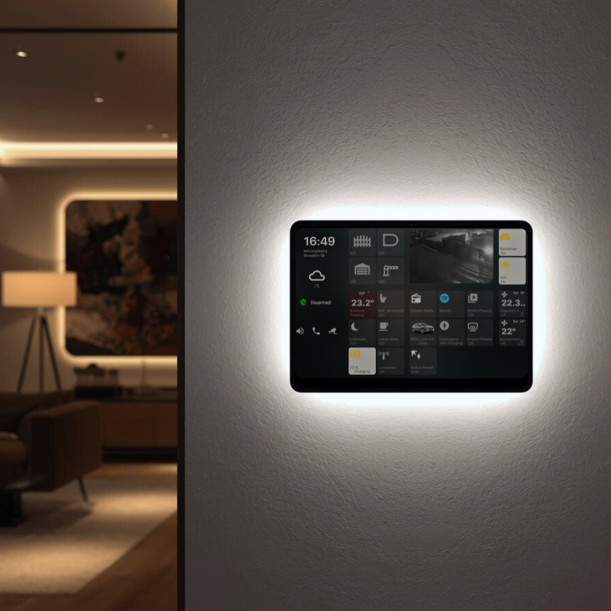
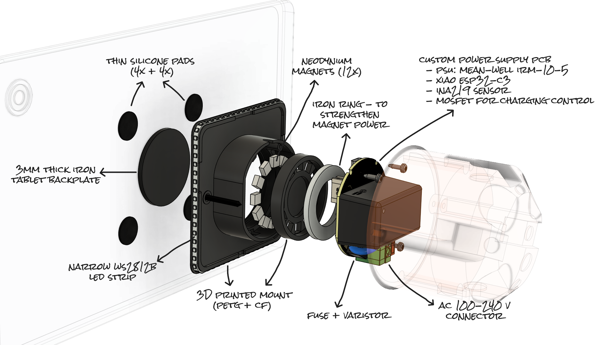

# Modo Tab Mount

**Smart tablet wall mount with ESPHome firmware, magnetic docking, and configurable smart features.**

## Overview

**Modo Tab Mount** is a modular smart wall mount for tablets, designed for **standard flush EU electrical wall back boxes**.  
It combines a clean, floating design with integrated smart electronics and Home Assistant compatibility.

The project is suitable for **makers, home automation enthusiasts, and developers** who want a customizable and extensible tablet mounting solution.

## Features

- **Magnetic Docking** – Secure, strong, snap-on mounting without mechanical locks  
- **Floating Design** – Minimal gap between tablet and wall  
- **Integrated Smart Power Supply** – 5V output for tablet charging and peripherals  
- **ESP32-based Controller** – Runs ESPHome firmware  
- **Backlit LEDs** – Optional WS2812B addressable LED bracket for status or ambient light  
- **Home Assistant Ready** – Native integration via ESPHome  
- **Expandable** – Support for additional sensors and peripherals  

## Hardware Components

| Component | Description |
|----------|-------------|
| Wall Box Mount | 3D-printed (PETG + CF filament) enclosure with embedded neodymium magnets / iron ring |
| Tablet Plate | 3 mm solid iron plate, attached using 3M VHB tape |
| Power Supply | Mean Well IRM-10-5 (5 V, 2 A) |
| PCB | Custom PCB for power distribution and peripheral connections |
| Microcontroller | Seeed Studio XIAO ESP32-C3 |
| LEDs | 2.7 mm WS2812B addressable LED strip |
| Charging Cable | Flat FPC cable with USB-C, Lightning, or Micro-USB connector |

## Repository Content

| Folder / File | Description |
|--------------|-------------|
| `PCB/` | Schematics and BOM for the custom PCB |
| `Docs/` | Installation instructions, datasheets, and technical documentation |
| `Images/` | Photos and diagrams |
| `modotabmount.yaml` | ESPHome firmware configuration |
| `README.md` | Project overview |
| `LICENSE` | License information |

## 📦 Firmware

**Modo Tab Mount** firmware runs on an **ESP32-C3** and is built using **ESPHome**.  
It provides charging control, power monitoring, Full LED RGB control with multiple built-in effects, and Home Assistant integration.

- Firmware is distributed as a **precompiled binary (`.bin`)** via **GitHub Releases**
- OTA updades with new firmware releases available
- End users **do not need to install ESPHome or compile firmware**
- ESPHome YAML file is included **for reference and advanced customization**

### 🔌 Smart Charging Control

- PWM-regulated 5V output for controlled tablet charging  
- Charging can be enabled or disabled remotely  
- During prolonged charging in a confined wall box, the power supply may warm up; firmware logic reduces or pauses charging to prevent excessive temperatures  

Charging state is exposed as a readable status  
(e.g. *Normal*, *Thermal throttling*, *Cooling down*).

### ⚡ Power & Energy Monitoring

An onboard **INA219** sensor measures:

- PSU Output voltage  
- PSU Output current  
- 30-second averaged values for stable reporting  

All values are available in **Home Assistant** and via the **built-in web interface**, enabling automations.

### 💡 LED Feedback & Ambient Lighting

Integrated **WS2812B LED strip** provides functional feedback and ambient lighting:

- Visual indication during **Wi-Fi access-point setup mode**
- Full RGB control with multiple built-in effects
- Automatic LED dimming during charging
- LED behavior configurable via Home Assistant or the local web interface

### 🌐 Connectivity & Interfaces

- Native **Home Assistant API** (ESPHome)
- Built-in **web interface** for local control and diagnostics
- **OTA firmware updates**
- **Bluetooth Proxy** support to extend Home Assistant BLE coverage

### ⚙️ Configuration & Diagnostics

User-configurable parameters include:

- Maximum temperature threshold
- Thermal throttle strength
- LED brightness during charging

Built-in diagnostics expose:

- Wi-Fi signal strength
- Device uptime
- Internal temperature
- Memory usage

A software-triggered factory reset is also available.

### 🔧 Advanced Usage

Advanced users may adopt device in ESPHome Builder, change YAML configuration and build custom firmware versions. 

---

## ⚠️ Safety Notice

This project involves **mains voltage (110–230 V AC)**.  Installation must be performed by qualified persons only.  

## 🏷 Commercial Product Note

This repository documents the **Modo Tab Mount project** and provides reference designs, firmware, and documentation intended for **makers and developers**.

A **commercially assembled Modo Tab Mount device**  offered separately by **MB Modoco**.  
Commercial units are:

- Assembled and tested by the manufacturer  
- Supplied with preinstalled firmware  
- Intended for end-user installation  
- Placed on the market under applicable EU conformity requirements  

The open-source materials in this repository are provided **for reference and non-commercial use** as defined by the applicable licenses.

## License

### Hardware (3D Models, Schematics, PCB Layouts)
Hardware designs in this repository are licensed under the  
**Creative Commons Attribution-NonCommercial 4.0 International (CC BY-NC 4.0)** license.

You may share and adapt these materials for **personal or educational use**.  
**Commercial manufacturing or resale is not permitted under this license.**

Full license text:  
https://creativecommons.org/licenses/by-nc/4.0/
### Firmware / Software
All firmware and software in this repository are licensed under the **MIT License**,  
allowing use, modification, and distribution, including for commercial purposes.

See the [LICENSE](./LICENSE) file for details.
